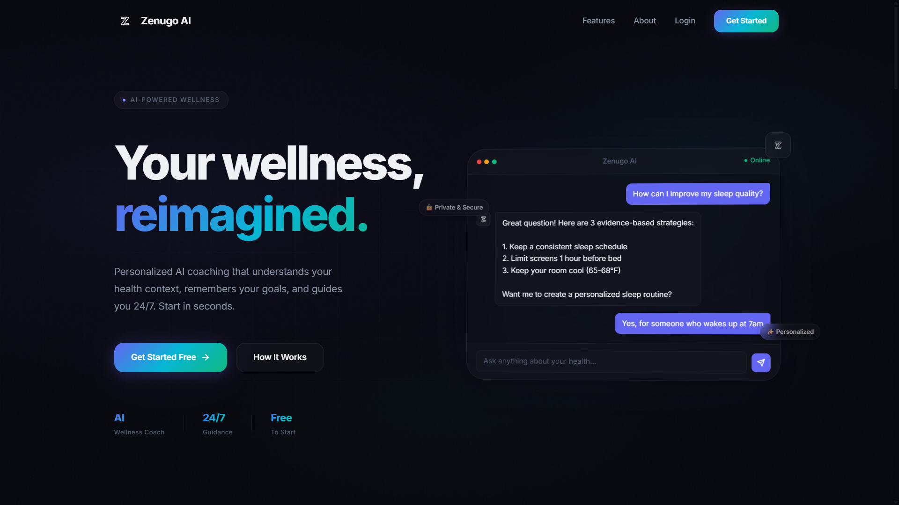
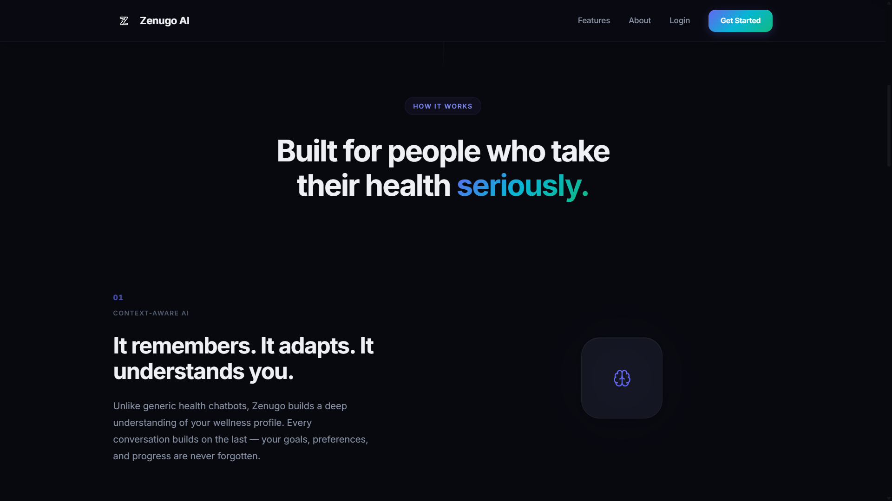
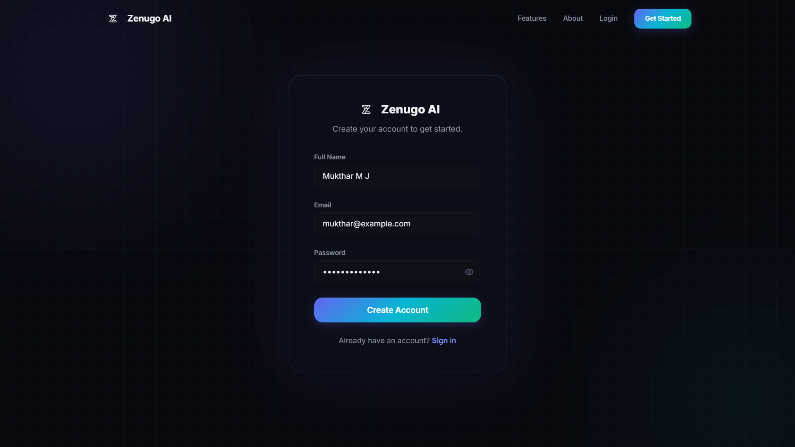
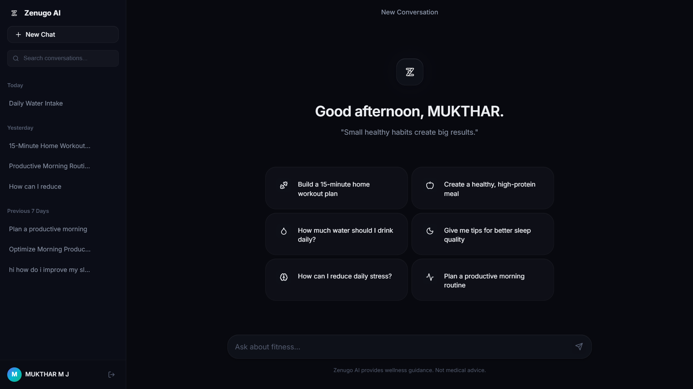
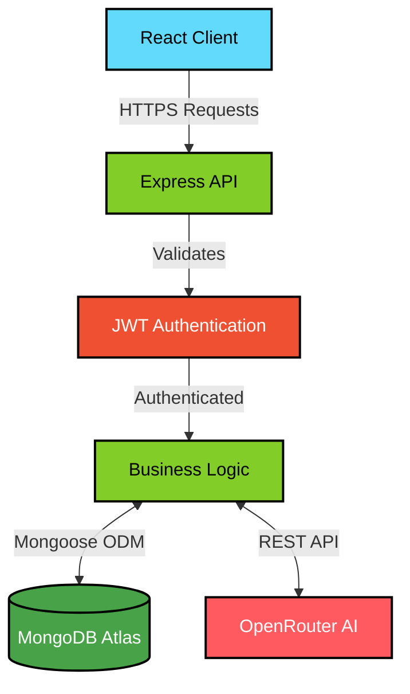

<div align="center">
  
  <h1>✨ Zenugo AI</h1>
  
  <p><strong>Your intelligent, AI-powered health and wellness companion.</strong></p>
  
  <p>
    Zenugo AI is a modern web application designed to provide personalized, concise, and actionable wellness, fitness, hydration, sleep, nutrition, and lifestyle advice through an intuitive chat interface.
  </p>

  <p>
    
    
    
    
    
  </p>
  
  <br />
  
  <p>
    <a href="https://zenugo-ai.vercel.app" target="_blank">
      
    </a>
    &nbsp;&nbsp;
    <a href="https://github.com/MuktharMJ/zenugo-ai" target="_blank">
      
    </a>
  </p>

  <br />

  

</div>

<br />

## Why Zenugo AI?

In an era of information overload, finding clear, actionable health and wellness advice can be overwhelming. Zenugo AI was built with a singular vision: to strip away the noise and provide individuals with a calm, focused, and deeply intelligent wellness companion. It is not designed to replace medical professionals, but rather to serve as a supportive guide for daily habits—ranging from hydration tracking and sleep optimization to mindful lifestyle changes. The platform emphasizes a frictionless user experience, ensuring that seeking advice feels like a natural conversation rather than a tedious search.

<br />

## ✨ Features

**AI Conversations**
- **Intelligent Wellness Guidance:** Powered by advanced language models to deliver concise, practical advice on fitness, nutrition, and lifestyle.
- **Context-Aware Responses:** The AI retains conversation history to provide relevant and continuous assistance.
- **Dynamic Chat Titles:** Automatically generates smart, summarized titles for new conversations based on your initial prompt.

**Authentication**
- **Secure Access:** Robust user registration and login flows.
- **JWT Sessions:** Stateless, secure session management using JSON Web Tokens.
- **Protected Routes:** Strict client-side and server-side route protection ensuring data privacy.

**Conversation History**
- **Persistent Chats:** All conversations are securely stored and easily retrievable.
- **Management:** Users can seamlessly switch between past conversations, rename them, or delete them when no longer needed.

**Modern Interface**
- **Premium Aesthetics:** Clean, minimalist design system utilizing Framer Motion for subtle, elegant micro-interactions.
- **Intuitive Layout:** Carefully crafted user journeys from the landing page to the core chat interface.

**Responsive Experience**
- **Mobile-First Design:** Fully responsive layout that adapts gracefully to any device, ensuring a seamless experience on desktop, tablet, and mobile.
- **Fluid Typography & Layouts:** Vanilla CSS executed with precision for maximum performance and visual harmony.

**Security**
- **Data Protection:** Passwords are cryptographically hashed, and sensitive routes are guarded by comprehensive middleware.

<br />

## 📸 Screenshots

| Landing Page | Authentication |
| :---: | :---: |
|  |  |

| Chat Interface |
| :---: |
|  |

<br />

## 🏗 Architecture

Zenugo AI employs a modern, decoupled architecture designed for scale and responsiveness. The client application handles UI state and routing independently, communicating with the backend via a secure RESTful API.



<br />

## 🛠 Technology Stack

| Category | Technology |
| :--- | :--- |
| **Frontend** | React 19, React Router DOM, Framer Motion, Lucide React |
| **Backend** | Node.js, Express.js 5 |
| **Database** | MongoDB Atlas, Mongoose ODM |
| **Authentication** | JSON Web Tokens (JWT), Bcrypt, Cookie Parser |
| **AI** | OpenRouter (DeepSeek Models) |
| **Deployment** | Vercel (Frontend), Render (Backend) |
| **Styling** | Vanilla CSS |
| **Build Tool** | Vite |

<br />

## 📂 Project Structure

```text
zenugo-ai/
├── client/                     # Frontend React application
│   ├── public/                 # Static assets
│   └── src/
│       ├── assets/             # Images and icons
│       ├── components/         # Reusable UI components (Navbar, Footer, Routes)
│       ├── context/            # React context providers (AuthContext)
│       ├── pages/              # Main route views (Home, Chat, Login, etc.)
│       └── services/           # API integration and external calls
├── server/                     # Backend Express application
│   ├── config/                 # Database and environment configurations
│   ├── controllers/            # Core business logic (Auth, Chat)
│   ├── middleware/             # Request interceptors (Auth verification)
│   ├── models/                 # Mongoose schemas (User, Message, Conversation)
│   └── routes/                 # Express route definitions
├── package.json                # Root workspace configuration
└── vercel.json                 # Deployment configuration
```

<br />

## 🚀 Production Deployment

Zenugo AI is deployed using a distributed architecture to ensure optimal performance and uptime:

- **Frontend (Vercel):** The React client is statically built via Vite and served on Vercel's edge network, ensuring ultra-fast load times and seamless routing.
- **Backend (Render):** The Node.js Express server is hosted on Render, providing a robust runtime for processing business logic, handling authentication, and serving API requests.
- **Database (MongoDB Atlas):** Data is securely stored in a fully managed MongoDB Atlas cluster, offering high availability and automated backups.
- **AI (OpenRouter):** The backend communicates with OpenRouter's high-performance API to generate intelligent responses with minimal latency.

The frontend securely communicates with the backend over HTTPS, safely transmitting authentication state without exposing tokens to client-side scripts.

<br />

## 🔒 Security

Security is a foundational element of the Zenugo AI architecture:

- **JWT (JSON Web Tokens):** Used for stateless, tamper-proof user authentication.
- **Password Hashing:** Utilizing `bcrypt` to ensure user credentials are cryptographically secure.
- **Protected Routes:** Both client-side wrappers and server-side middleware strictly enforce authentication requirements before granting access to sensitive resources.
- **Authorization:** Database queries are strictly scoped to the authenticated user ID (`req.user.userId`), ensuring users can only access their own conversations and messages.
- **Environment Variables:** All secrets, database URIs, and API keys are securely managed via environment variables and never committed to source control.

<br />

## 🗺 Roadmap

- **Advanced Context Windowing:** Implement sliding context windows to allow for endlessly long conversations without hitting token limits.
- **Personalized Health Profiles:** Allow users to set baseline metrics (age, fitness goals, dietary restrictions) to tailor AI responses even further.
- **Voice Integration:** Introduce speech-to-text input and text-to-speech output for a hands-free conversational experience.
- **Data Export:** Give users the ability to export their conversation histories and wellness plans.

<br />

## 👨‍💻 Author

**Mukthar M J**

- GitHub: [https://github.com/MuktharMJ](https://github.com/MuktharMJ)
- LinkedIn: [https://www.linkedin.com/in/mukthar-m-j-/](https://www.linkedin.com/in/mukthar-m-j-/)
- Portfolio: *Coming Soon*

<br />

## 📄 License

This software is proprietary.

Copyright © 2026 Mukthar M J.

All Rights Reserved.

Viewing the source code does not grant permission to copy, modify, redistribute, or reuse any part of this project without explicit written permission from the author.
